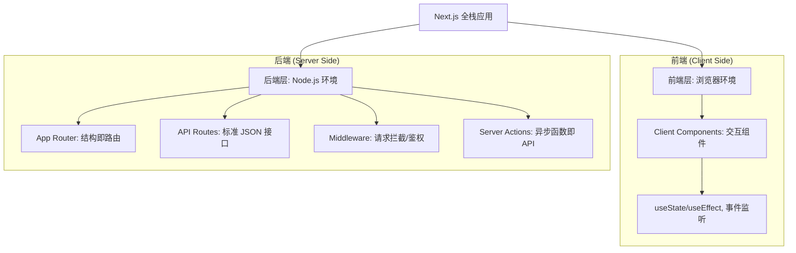

# Nextjs介绍&全景地图

> 前言：由于笔者是个后端攻城狮，很多地方会以后端来做类比~ 

Nextjs是一个基于React的全栈开发框架，由Vercel开发和维护，它在React的基础添加了很多后端的功能支持。 例如路由，服务器渲染SSR，API逻辑、中间件和工程化打包全部整合到了一起。 

NextJS设计的思路是**一个框架同时覆盖前后端**
```
Next.js 完整模式
├── 前端
│   ├── Pages / App Router   → UI 渲染
│   └── Client Components    → 浏览器交互
└── 后端
    ├── API Routes            → 接口逻辑
    └── Middleware            → 请求拦截（鉴权、重定向、A/B 测试）

```



### 一、文件夹即路由

作为后端工程师，我们可能会给接口添加路由配置。 比如spring里面的@RequestMapping 

NextJs摒弃了复杂的路由配置文件，文件夹名称就是URL路径。

**核心概念**: 使用app目录组织路由结构，每个路由段对应一个文件夹

**特殊文件约定:**
- page.js: 定义路由UI和公开访问点
- layout.js: 定义共享布局，可嵌套
- loading.js: 创建加载UI，自动集成Suspense
- error.js: 处理错误，自动集成Error Boundary
- not-found.js: 处理404错误

例如 ：
`app/page.tsx`  对应的是首页
`app/users/page.tsx` 对应的是 `users`页面
`app/api/login/route.ts` 对应的就是 /api/login 接口

page.tsx 负责渲染html，route.ts 则负责返回json 

在nextjs中，有两套路由系统：

| 路由系统         | 版本           | 现状      |
| ------------ | ------------ | ------- |
| Pages Router | nextjs 12及之前 | 可用，但不推荐 |
| App Router   | nextjs13+    | 当前主流    |

🤔技术深究：
Nextjs的客户端组件，其实是基于React官方提出的一项技术规范，叫做React Server Components (RSC) ，它改变了 React 组件的运行位置：

- 在 RSC 出现前，React 组件全部都在浏览器运行。
- 在 RSC 出现后，React 把组件分成了两类：服务端组件 和 客户端组件。
所以，**RSC 是nextjs服务器组件的父级概念**，它规定了这两种组件如何配合、数据如何从后端流向前端。 

### 二、 服务器组件 

作为后端工程师，你一定写过类似 `SELECT * FROM users` 的代码。

在传统 React 里，过程是这样的：
1. 服务器发一个空白的 HTML 给浏览器。
2. 浏览器运行 JavaScript，发现需要数据。
3. 浏览器发一个 `fetch('/api/users')` 请求给服务器。
4. 服务器查数据库，返回 JSON。
5. 浏览器拿到 JSON，再渲染成列表。 （这中间至少跨越了两次网络请求，浏览器还累得半死）


在 Next.js 服务端组件里，过程变成了：
1. 服务器直接执行代码：`await db.query('SELECT...')`。
2. 服务器把数据填进 HTML 模板。
3. 服务器把渲染好的 HTML 发给浏览器。 （浏览器拿到就是现成的页面，速度极快，且不需要安装数据库驱动，因为那是服务器的事）

代码例子如下：
```ts
// app/users/page.tsx
// 这是一个服务端组件默认在服务器上运行，因为它没写 'use client'
import { db } from '@/lib/db'; 

export default async function Page() {
  const users = await db.user.findMany(); // 直接查数据库，不需要useEffect,不需要api调用 
  
  return (
    <ul>
      {users.map(u => <li key={u.id}>{u.name}</li>)}
    </ul>
  );
}
```

这样做的有几个特点： 
- **数据获取**：通过将数据获取移动到服务器端，可以减少获取数据所需的时间，提高性能。同时减少客户端发出的请求次数。
- **安全性**：敏感数据和逻辑可以在服务器上处理，不暴露给客户端，提高安全性。
- **缓存**：在服务器端呈现可以缓存和重用结果，降低渲染和数据提取成本，并提高性能。
- **性能**：通过将非交互式部分移动到服务器，可以优化性能，减少客户端 JavaScript 的量，对于网络速度较慢或设备性能较弱的用户有益。
- 没有动态交互了：因为在服务器上就已经渲染成html了，它不能用useState,不能用OnClick事件 


### 三、客户端组件

服务端组件不能用： 
- `useState`、`useEffect` 等 React Hooks
- `window`、`document` 等浏览器 API
- `onClick` 等事件处理
那么，当你需要用这些能力的时候，你需要在文件顶部加一行`use client` 


在 Next.js 的世界里，地图是这样拼的：
1. **大框架（服务端组件）**：负责去数据库拿数据，把页面整体框架和文字内容渲染出来。
2. **小零件（客户端组件）**：在需要点的地方，通过 `'use client'` 标记，把这个小零件塞进大框架里。

### SSR、SSG、ISR

因为这几个主要是针对服务端组件 (RSC)的。所以就直接在这里写了——  


一、==SSG (静态站点生成)：离线预处理==
- 类比：就像你写了一个脚本，把数据库里的 1000 条博客文章全部读取出来，生成了 1000 个静态的 `.html` 文件存放在磁盘上。
- 触发时机：Build Time（构建时）。在你执行 `npm run build` 的那一刻，数据就定格了。
- 适用场景：帮助文档、官方博客、营销页面。
- Next.js 实现：默认行为。只要你的组件没用动态数据（如 Headers、Cookies），Next.js 就会自动把它打包成 SSG。

二、==SSR (服务端渲染)：实时生成==
- 类比：经典的 PHP/JSP 模式。用户每点一次，后端就查一次数据库，渲染一次 HTML 传回去。
- 触发时机：Request Time（请求时）。
- 适用场景：个性化控制面板、需要实时权限校验的页面、搜索结果页。
- Next.js 实现：在 fetch 请求中设置 `{ cache: 'no-store' }`，或者在页面中声明 `export const dynamic = 'force-dynamic'`。

三、 ==ISR (增量静态再生)：带过期时间的缓存==
- 类比：Redis 缓存 + 过期策略。你先给用户看缓存里的旧 HTML，但如果这个缓存超过了 60 秒（过期了），后台会默默启动一个进程去查数据库，生成一个新的 HTML 替换掉旧缓存。
- 核心优势：既有 SSG 的极致速度，又不会像 SSG 那样数据永远不更新。
- 适用场景：新闻列表、商品详情页、社交媒体信息流。
- Next.js 实现：在 fetch 请求中设置 `revalidate` 参数。

当你写一个服务端组件时，Next.js 会根据你的数据获取方式，自动决定它走哪种策略：
- SSG 模式：你的服务端组件里 `fetch` 的数据是静态的。
- SSR 模式：你的服务端组件里用了 `cookies()` 或 `headers()`，或者 `fetch` 禁用了缓存。
- ISR 模式：你的服务端组件 `fetch` 时设置了 `revalidate: 60`。


无论你的页面是 SSG（静态）还是 SSR（动态），页面里的客户端组件都会经历两个阶段：
1. **首屏渲染 (Pre-rendering)**：在服务器上先渲染出一个“静态快照”，让你一眼就能看到按钮。
2. **注水 (Hydration)**：到了浏览器后，JavaScript 运行，按钮才变得“能点”。


结合上面的介绍， 给后端工程师的性能决策心法

当你构建一个功能（比如一个博客系统）时，你的思考路径应该是这样的：
1. **第一步（选空间）**：这个组件需要查数据库吗？需要。—— **选 Server Component**。
2. **第二步（选时间）**：这个数据需要每次用户刷新都变吗？
    - 不需要（比如文章内容）—— **选 SSG**。
    - 需要，但可以接受延迟（比如点赞数）—— **选 ISR**。
    - 必须实时（比如当前用户的登录状态）—— **选 SSR**。
3. **第三步（加点缀）**：这个页面里有地方需要用户点一下弹窗吗？有。—— 把那个按钮拆成 **Client Component** 塞进去。


### 水合

参考文章： https://juejin.cn/post/7520911407015247914 

(这篇好详细，我就不多写了)

这里列一下经常出现水合报错的办法 

|**场景**|**错误原因**|**解决逻辑**|
|---|---|---|
|**随机数/时间**|`Math.random()` 或 `new Date()` 在服务器和浏览器算出的值不同。|在 `useEffect` 里更新这些值，确保只在客户端运行。|
|**浏览器特有 API**|尝试在渲染层直接读取 `window.localStorage`（服务器没这东西）。|检查 `typeof window !== 'undefined'`。|
|**不规范的 HTML**|比如在 `<p>` 标签里嵌套了 `<div>`。|修正 HTML 结构，遵循标准。|
|**不同的语言/时区**|服务器是 UTC 时间，浏览器是用户当地时间。|统一使用后端传来的时间戳。|

### Server Action

作为后端工程师，Server Actions 可能会是我最喜欢的 Next.js 特性。因为它在很大程度上消灭了传统的 API 编写工作。

在传统的全栈开发中，为了实现一个“用户留言”功能， 需要：
- 后端：写一个 POST /api/comments 的路由，处理 Request，校验数据，存入数据库，返回 JSON
- 前端：写一个表单，绑定 onSubmit，用 axios 或 fetch 发送异步请求，处理 loading 和 error 状态。
Server Actions 的出现，让这一切在写“本地函数调用”一样完成这一切。

**什么是 Server Actions？**

Server Actions 是 Next.js 提供的一种 函数式 RPC（远程过程调用） 。

简单来说：你可以在代码里写一个普通的 `async` 函数，给它贴一个标记 `'use server'`。然后，你直接在前端的 `<form>` 或者按钮点击事件里调用这个函数。

==Next.js 会在底层自动帮你把这个函数转换成一个 POST 接口，并处理所有的网络通信。==

代码示例：
```ts
// app/actions.ts (也可以直接写在 Server Component 文件里)
'use server'; // 关键标记：告诉 Next.js 这函数只能在服务器跑

import { db } from '@/lib/db';

export async function createPost(formData: FormData) {
  const title = formData.get('title');
  
  // 1. 直接操作数据库
  await db.post.create({ data: { title } });
  
  // 2. 告诉 Next.js：数据变了，刷新缓存吧
  revalidatePath('/posts'); 
}
```

前端组件的代码：

```ts
// app/page.tsx
import { createPost } from './actions';

export default function Page() {
  return (
    <form action={createPost}> {/* 像调用本地函数一样简单 */}
      <input name="title" />
      <button type="submit">提交</button>
    </form>
  );
}
```

关键点： 
① 安全性：它依然是后端代码
虽然它在前端被调用，但 Server Action 永远运行在服务器端。这意味着：
- 你可以放心地在函数里写 `process.env.SECRET_KEY`。
- 你可以直接调用数据库、文件系统。
- **注意**：你必须像写 Controller 一样，在函数内部进行鉴权和参数校验（比如用 `zod` 库），因为这个函数本质上还是暴露出去的一个 API 端点。

② 渐进式增强 (Progressive Enhancement)
- 即使用户的浏览器禁用了 JavaScript，或者 JS 包还没下载完，表单依然能提交成功。
- 这是因为 Next.js 模拟了原生 HTML Form 的行为，这极大地提升了应用的稳健性。

 ③ 自动缓存刷新
- Server Actions 配合 `revalidatePath` 或 `revalidateTag`，可以让你在执行完后端逻辑后，直接指令 Next.js 重新获取相关页面的数据。

和API Routes的区别： 

| 特性   | Server Actions                | API Routes            |
| ---- | ----------------------------- | --------------------- |
| 调用方式 | 直接调用函数                        | 通过 HTTP (fetch/axios) |
| 类型安全 | 原生 TypeScript 支持 (自动推导参数和返回值) | 需要手动定义接口协议            |
| 主要用途 | 紧密耦合的 UI 交互（如表单提交、收藏）         | 供第三方调用、移动端调用、通用 API   |
| 使用成本 | 极低（感觉就在写一个函数）                 | 较高（需考虑路由、状态码、JSON 包装） |


### Middleware 

**Middleware** 在请求到达页面之前执行，比如：

- 检查 cookie/token → 没登录跳转到 `/login`
- 按地区返回不同语言版本
- 限流


### 剩余待填坑 
- turbopack：基于Rust的打包工具，提供更快的开发体验和热加载
- 内置优化： 自动图像，字体和脚本的优化，无需额外配置
- SEO优化：内置元数据的API和架构化数据支持
- 国际化路由：内置多语言支持，简化国际应用开发


 # React 

React 是一个UI库，核心思想是 

> UI = f(state)
	界面 = 函数(状态)
	即：*你的界面是状态的函数，状态变了，界面自动更新*

### React 的渲染机制


## hook

 hook 是一种特殊的函数，允许你把一些react特性钩进来。

> 记住，在js里，值就是函数，函数就是值。 

react 为何要加入hooks

1. 无法在组件之间复用数据处理的逻辑，或者不够直接，例如props或者高阶组件的实现方式
2. 复杂组件越来越难理解，容易引入bug
3. Class语法带来复杂性 

### useState 数据驱动界面


```javascript
import React, { useState } from "react";

export default function  Button()  {
  const  [buttonText, setButtonText] =  useState("Click me,   please");

  function handleClick()  {
    return setButtonText("Thanks, been clicked!");
  }

  return  <button  onClick={handleClick}>{buttonText}</button>;
}
```

Button 组件是一个函数，内部使用`useState()`钩子引入状态。

`useState()`这个函数接受状态的初始值，作为参数，上例的初始值为按钮的文字。该函数返回一个数组，数组的第一个成员是一个变量（上例是`buttonText`），指向状态的当前值。第二个成员是一个函数，用来更新状态，约定是`set`前缀加上状态的变量名（上例是`setButtonText`）。


### 何时需要useState：

useState 是让函数组件具备维持状态（记忆）的能力。

即：在一个函数组件的多次渲染之间，这个 state 是共享的。便于维护状态。

> **当页面上的数据会变化，并且变化后需要重新渲染 UI 时，就应该用 `useState`。**

举个例子： 
``` js
function Counter() {
  let count = 0;

  return (
    <>
      <p>{count}</p>
      <button onClick={() => count++}>
        +1
      </button>
    </>
  );
}
```

你觉得点击以后应该变成：0 1 2 3 4 其实一直都是0 ，因为 React **不会因为普通变量变化而重新渲染页面。**  useState 就是 React 提供的"记忆" 

### useEffect  处理副作用

useEffect 就是处理 *渲染之外的事情*，比如：

- 获取数据
- 订阅事件 
- 操作DOM
- 设置定时器

```javascript
useEffect(()  =>  {
  // Async Action
}, [dependencies])
```

`useEffect()`接受两个参数。第一个参数是一个函数，异步操作的代码放在里面。第二个参数是一个数组，用于给出 Effect 的依赖项，只要这个数组发生变化，`useEffect()`就会执行。第二个参数可以省略，这时每次组件渲染时，就会执行`useEffect()`。


### useCallBack -- 缓存函数

>`useCallback` 和 `useMemo` 在性能优化方面非常有用。 当我们需要对函数进行性能优化时，可以使用 他们


用于缓存函数，以避免重新渲染时的函数重新创建。以一个示例来说明：


``` JSX
import React, { useState, useCallback } from "react";

function Counter() {
  const [count, setCount] = useState(0);

  const handleIncrement = useCallback(() => {
    setCount(count + 1);
  }, [count]);

  return (
    <div>
      <p>Count: {count}</p>
      <button onClick={handleIncrement}>Increment</button>
    </div>
  );
}

```

在以上代码中，我们使用 `useCallback` 缓存了 `handleIncrement` 函数，并将 `count` 作为依赖项传递。这样，在 `count` `改变时，handleIncrement` 函数才会重新创建。由于函数变化往往会导致组件重新渲染，因此使用 `useCallback` 可以避免不必要的重新渲染。

### useMemo -- 缓存计算结果

 类似useCallback，但它用于缓存值而不是函数。例如：

``` jsx 
import React, { useMemo } from "react";

function computeExpensiveValue(a, b) {
  // 一些复杂的计算
  return a * b;
}

function MyComponent({ a, b }) {
  const result = useMemo(() => {
    return computeExpensiveValue(a, b);
  }, [a, b]);

  return <p>{result}</p>;
}

```

使用 `useMemo` 缓存了 `result`，以避免每次重新渲染时重新计算。这在处理复杂计算时可以提高性能。


### useRef -- 存储不渲染的值 

主要是给了一个可变的容器，改了它不会触发重新渲染，两个主要用途：

1、 拿到DOM元素

2、 存储不需要触发渲染的可变值 

``` js
// 来自 src/hooks/useDraft.ts
  const localTimer = useRef<ReturnType<typeof setTimeout> | null>(null);
  const remoteTimer = useRef<ReturnType<typeof setInterval> | null>(null);
  const dirtyRef = useRef(false);  // "脏"标记

  这些定时器 ID 不需要显示在 UI 上，用 useRef 正合适——清理 effect
  时能拿到最新的 ID，但改了不用重新渲染。
```


##  状态管理

https://www.codexlin.com/blog/zustand-quick-start

https://juejin.cn/post/7533418224172548146#heading-13